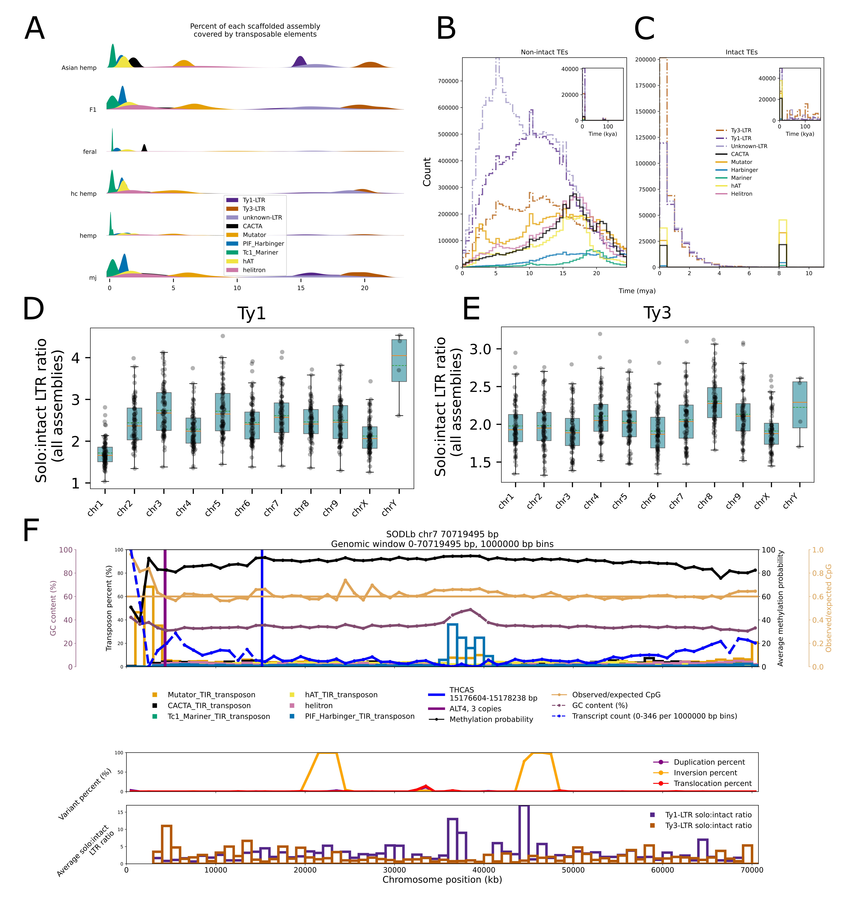

# Cannabis Pangenome Transposable Elements

## The data included in this repo is intended to be run as a demo. The full analysis featured in the manuscript includes 78 scaffolded, chromosome-level, haplotype-resolved genomes.

  

